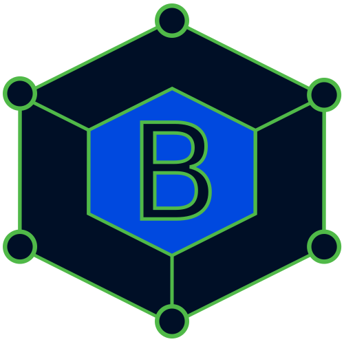
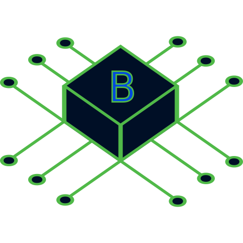

  


# BinaryBox 

The primary goal of Binary Box is to simplify protocol communications across various connection types/endpoints.  

```csharp
bool[] coils = await modbusAsciiClient.ReadCoilsAsync(40,50);
```


## BinaryBox.Core

At the core, Binary Box provides a loosely coupled and testable framework for building connection endpoints, protocol messages, and protocol clients.
-	**IConnection** defines a common interface for various endpoint IO operations such as connecting, disconnecting, reading and writing
-	**IProtocolMessage** provides the required interface for building protocol messages that can be encoded and decoded by the protocol client
-	**IProtocolClient** interface defines a simple interface for processing IProtocolMessages

## BinaryBox.Connection

## BinaryBox.Connection.Tcp

## BinaryBox.Protocol

## BinaryBox.Protocol.ModbusAscii

## BinaryBox.Protocol.ModbusRtu

## BinaryBox.Protocol.ModbusTcp

## BinaryBox.Checksum

## BinaryBox.IEEE
